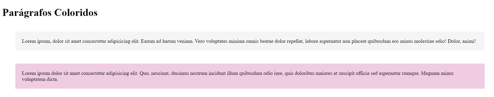

# Parágrafos Coloridos
Projeto de um exercício proposto para criar parágrafos coloridos usando HTML e CSS.

## Exercício proposto

Crie 2 parágrafos com:

- Cor de fundo diferente em cada um:
    * Parágrafo de estilo padrão com fundo cinza claro (#F5F5F5).
    * Parágrafo de estilo destacado com fundo colorido (#F0CCE2).

- Espaçamento entre um parágrafo e outro de 40px.

- Espaçamento interno de 20px.

- Aplique o fundo nos parágrafos de forma que facilite a manutenção caso mais parágrafos sejam adicionados no futuro.

## Resultado Final

## Tecnologia Utilizada
- HTML
- CSS